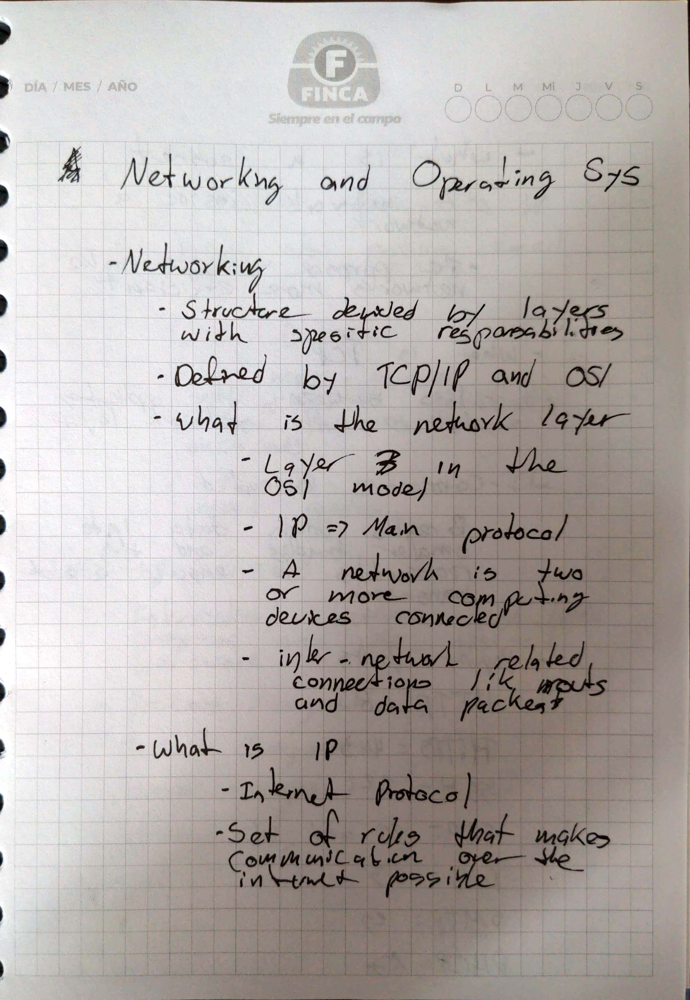
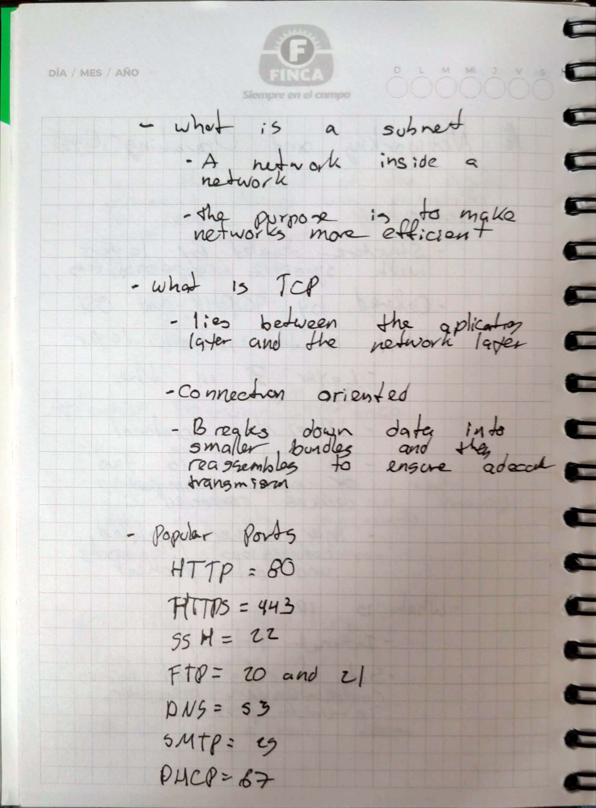
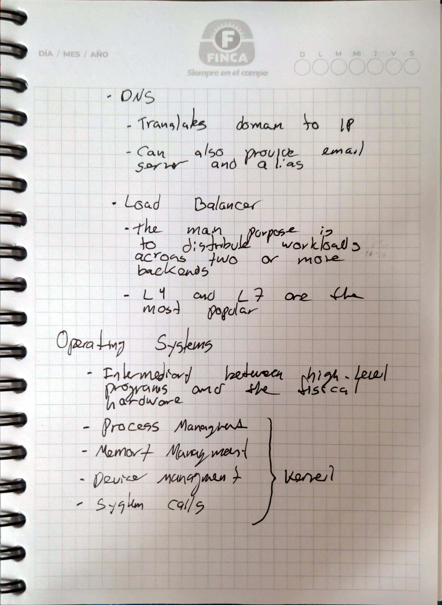

# Networking and Operating System
## Goal 
To review key concepts of Networkin and Operating Systems 
## Methodology 
1. Read the provided informational text
2. Made handwritten notes with key concepts from the text
3. Answer questions asked in the newtorking section in regards to load balancing
## Handwritten Notes 

  
  
  

## Load Balancing Questions

[Answers]("./notes/load_balancing_questions.txt")
