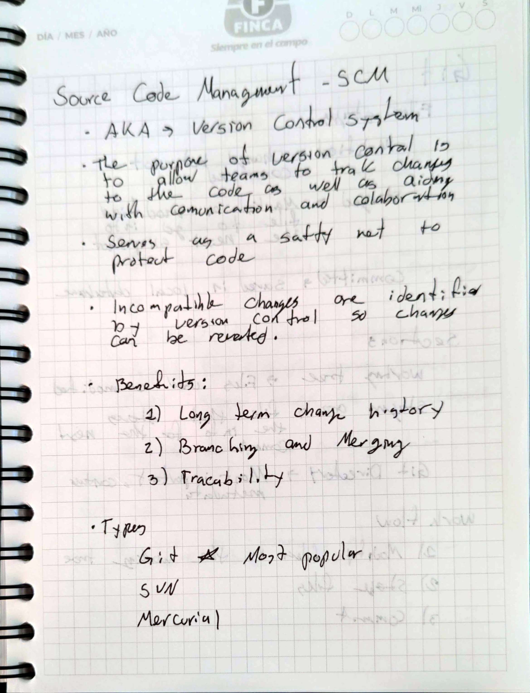
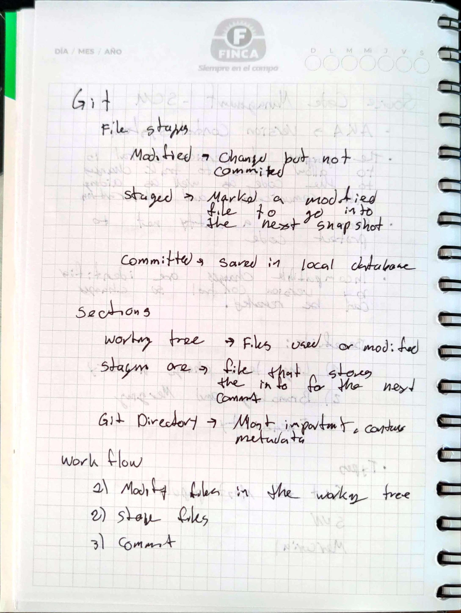
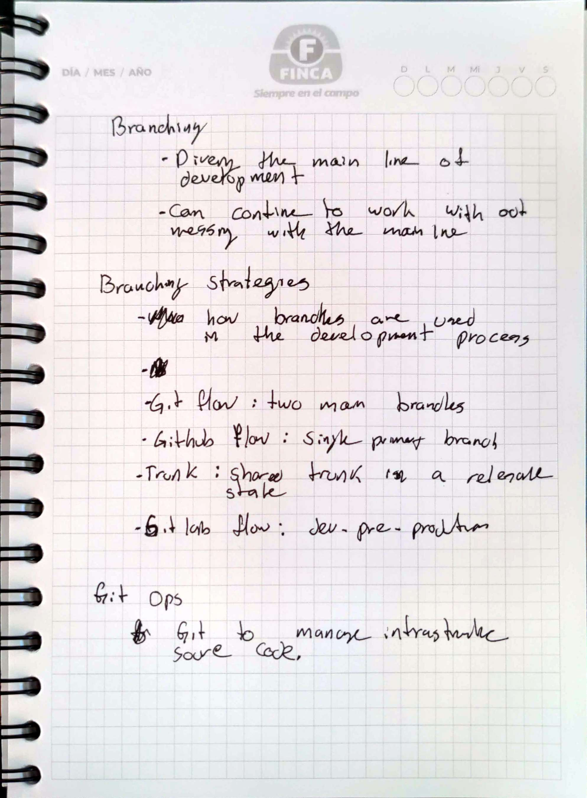

# Source Code Management – SCM

## Goal 
Learn about source code managment, the different ways it can be done but with a focus con git. 

## Methodolody 
1) Read the provided text
2) Create notes with key concepts and iformation
3) Complete the challanges proposed in the guide

## Handwritten Notes

    
    
    

## Challanges 
* For gaming practice we suggest you to do at least one of the following websites. If you want you can do all of these:

  - https://learngitbranching.js.org/
  - https://ohmygit.org/
  - https://gitexercises.fracz.com/
  - https://www.w3schools.com/GIT/exercise.asp?filename=exercise_getstarted1

* Create repositories for your scripts and next challenges

* Select a branching model and apply it to your repositories. Make a diagram explaining the branching model.
