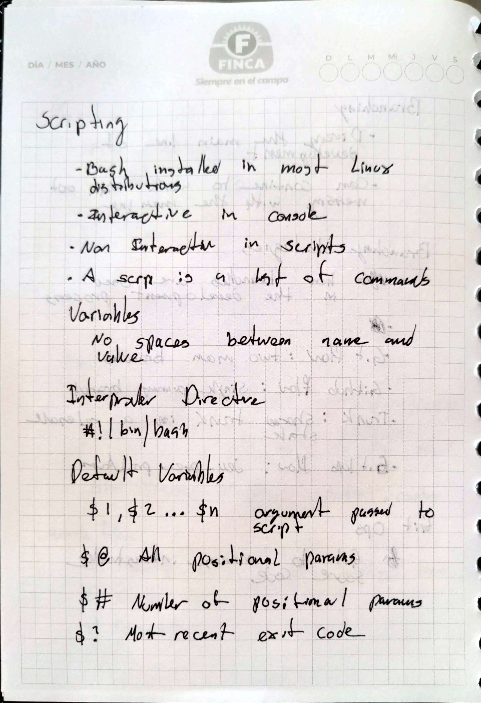
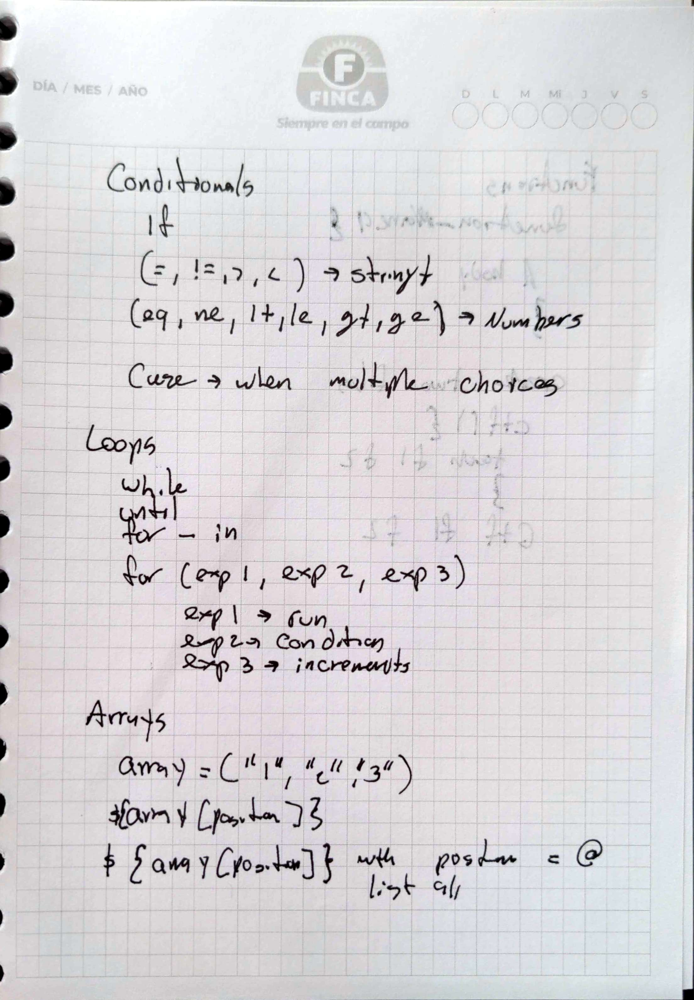
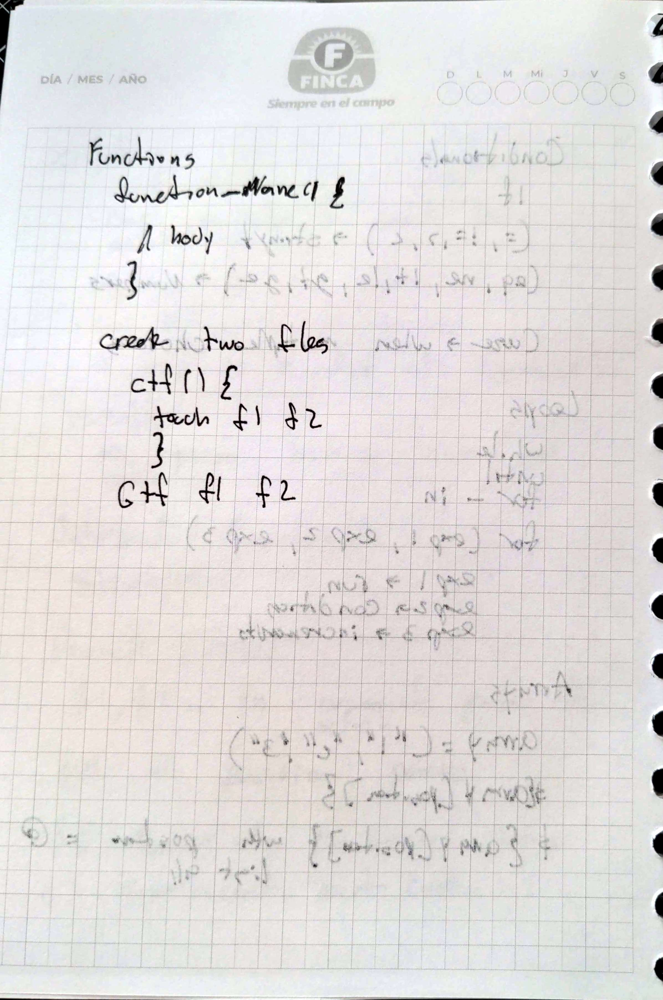

# Scripting 

## Goal 
To better understand bash scripting
## Methodology 
1)  Read the provided text
2)  Elaborate handwritten notes
3)  Complete the challanges
4)  Complete additonal challange proposed by mentor
## Handwritten Notes 

    
    
    

## Repo

[Link To The Repositoroy With The Script](https://github.com/PJCB1998/DevOpsRampUpCh05)

## Challanges 
1)  Display only the even numbers from 1 to 100.
2)  Compare natural numbers and display "X is greater than Y", "X is equal to Y" or "X is less than Y".
3)  Read N numbers from the stdio and compute their average.
4)  Check if a file exists, if it doesn't exist, create it.
5)  Write a script that outputs the current time and date. For example: "Current time: 08:02, Current date: 2022-08-10"
6)  Write a script that prints how many parameters are passed and which ones? For example, if I run the script like this: `./script1 p1 p2 p3 p4`, then it should print: `4 params were passed and they're these ones: p1, p2, p3, p4`
7)  Write a script that prints information about your OS and version, release number, and kernel version.
8)  Write a script that checks if cups service is running. If it running, print "Cups' status is running". Otherwise, prints "Cups's status is stopped".
