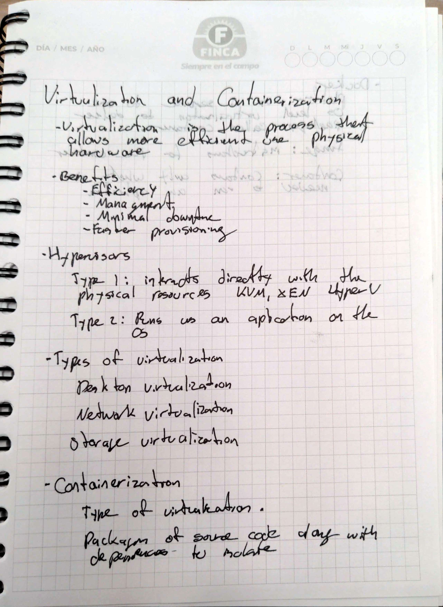
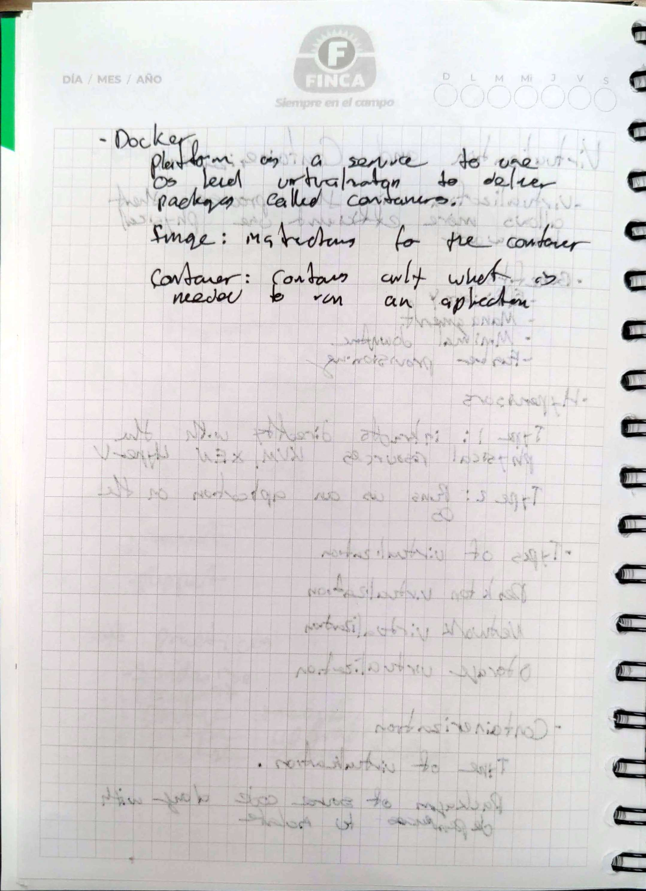

# Virtualization and Containerization

## Goal 
Learn about Virtualization and its advantages. Aswell to learn about hypervisor types of virtualization. 
## Methodology 
  1) Read the text provided
  2) Solve the challanges proposed in the guide
  3) Configure the microservice aplication using Docker

## Handwritten Notes 
<p align="center">
    
    
</p>

## Repo 


## Challenges 
## Container challenges

* Run the "Hello, World" Docker container. Make sure you understand the concepts of Container Registry, pulling and pushing an image to a Registry.
* Run a program that you want from a Docker container. It can be a web server, a database or even a programming language. 
* Run a container based on this image *devopsdockeruh/simple-web-service:ubuntu*. The image creates a container that outputs logs into a file. Go inside the container and use `tail -f` command to follow the logs. What's the secret message it outputs?
* Given the following script, create an image from it. 
```bash
#!/bin/sh

echo "Hello, Perficient!"
```
* When you pass the *server* command to the *devopsdockeruh/simple-web-service* image, it will create a container with a web service running on port 8080. Access it from your localhost address. You will get a message like this: "{ message: "You connected to the following path: ..."
* Make sure you understand the **docker-compose** command. How to install it and what we need it for. [Here](https://www.baeldung.com/ops/docker-compose) you can find information about it.
* Create a Dockerfile for every microservice in [our microservice application](https://github.com/bortizf/microservice-app-example). After that, run each microservice separately.
* Finally, create a docker-compose file to run all the microservices at once.

