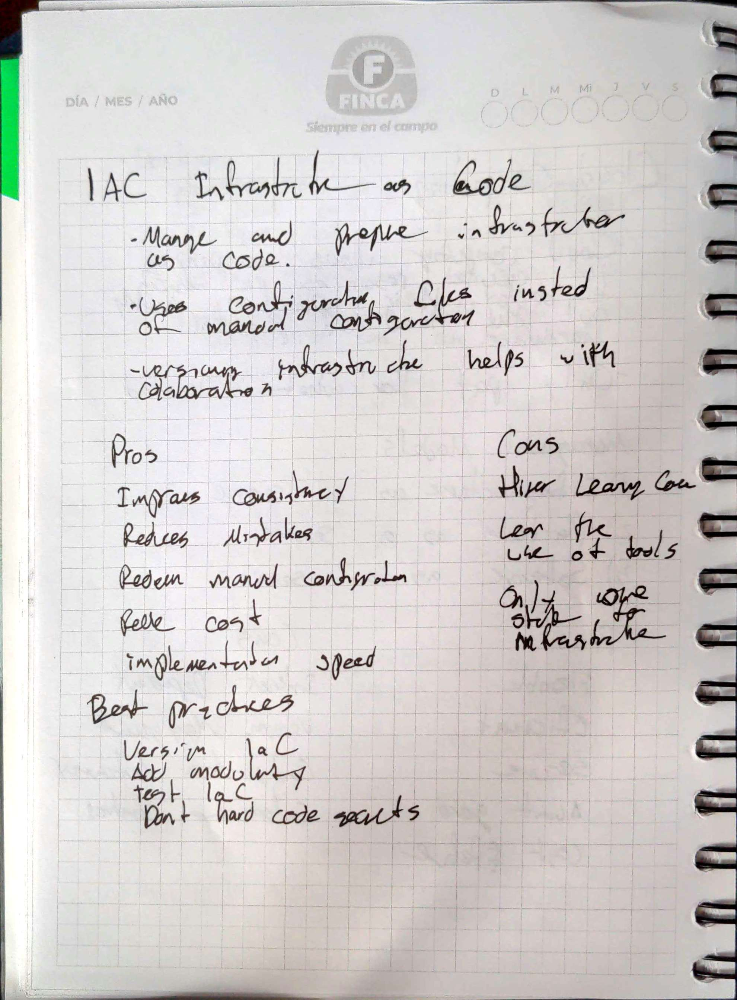

# Infrastructure as Code 

## Goal 
To understand Infrastructure as Code with a focus in Terraform
## Methodology 
1) Read the provided text
2) Research Terrafrom 
3) Deploy the microservice aplication using Terraform
## Handwritten Notes 

    

## Challenges 

Let's get to work! in this challenge you'll do the same things we did on the previous chapter, but using IaC:

1) **Choose an IaC tool**: we saw some tools for doing IaC on this chapter. Read about them, see their pros and cons and choose the one that you like the most!
        We recommend using Terraform if you can't decide on any tool.
2) **Implement all your Infrastructure as code**: create your scripts that will set up all your infrastructure just as you did manually on the previous
        chapter! you should be able to create and destroy your infrastructure using a single (or a couple of) command(s), don't forget to apply the best
        practices seen here!
3) **Use a VCS for storing your IaC**: just as you'll do with any other code, upload your scripts to a VCS in order to keep track of your code versions.
4)  **Test your Infrastructure's High Availability**: remember, we want to set up a High Availability infrastructure, make sure that everything is working ok!
