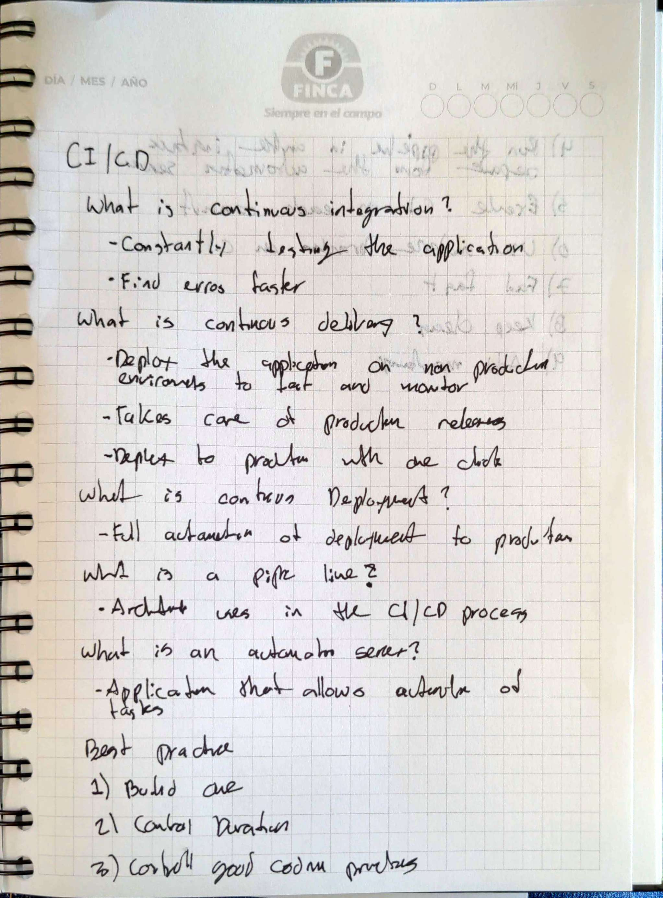
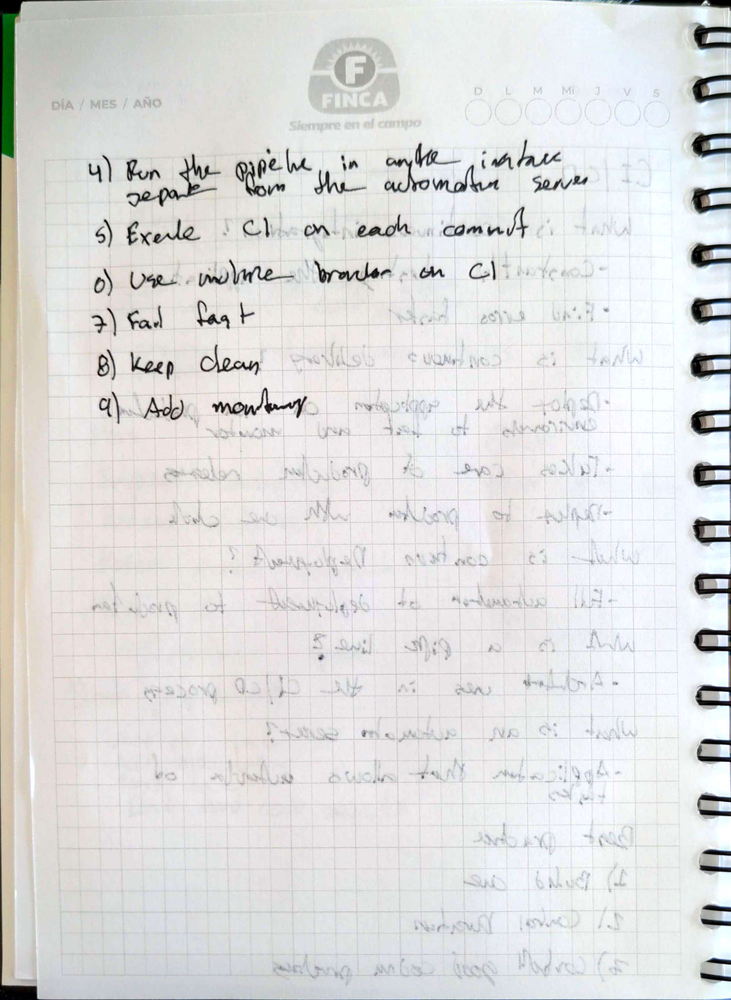

# Continuous Integration (CI) and Continuous Delivery (CD)

## Goal
To learn about CI/CD and Github Actions

## Methodology 
1. Read the provided Text
2. Learn more about Github Actions to solve the challenges 
3. Solve the challenges using Github Actions

## Handwritten Notes

    
    

## Actions Repo 
[Link to the repository with actions to the challenges](https://github.com/PJCB1998/DevOpsRampUp-frontend/actions)

## Challenges 
### CI

1. **Design and create a diagram of your CI Pipeline**: Before we start throwing code, let's internalize the concepts first, create a diagram
in a way that you can identify each stage that makes up your pipeline and their internal steps.
2. **Choose an Automation Server**: We saw one of the most used Automation Servers on this chapter. Give them a look and choose the one you like most!
3. **Implement the pipeline you created in the Automation Server you chose.**: Let's implement the main steps of the CI process that we saw on the diagram before!
   1. **Build your application**: remember that you created several dockerfiles before for your application? create your pipeline so you build your docker images.
   2. **Upload your docker image to your docker registry**: You need an account on DockerHub for this step, push your docker images to DockerHub for pulling them later.
   3. **Execute your application's tests!**: Some services of your application have tests, execute them! add errors to your code and test how your pipeline should fail if a test doesn't pass, remember to **fail fast**.
4. **Configure your application's repository to have a webhook to your pipeline and trigger builds automatically on each commit.**
5. **Configure your Automation Server to use an agent node for executing your pipelines**: Instead of doing it all on the same instance, create another
instance on AWS and link it with your Automation Server instance to use it for running builds.

### CD

1. **Design and create a diagram of your CD Pipeline**: Just as you did with your CI Pipeline.
2. **Implement the pipeline you created in the Automation Server you chose.**: Now let's implement the deployment process!
   1. **Set up your infrastructure**: create an EC2 Instance and install docker on it. 
   2. **Pull your docker image**.
   3. **Run your containers with docker!**: You can do it as we did on the virtualization chapter, having one instance per tier or service, but instead
   of running them directly, use Docker for running containers on each instance.
3. **Choose the policies of when you are going to deploy**: Similar to when we configure our webhook on the application's repository, for example, 
you may want to deploy each time a PR is merged, who should be allowed to deploy at an organization and in which environments?
4. **Research and learn about deployment strategies.**: A deployment strategy is a way of changing or upgrading your application without tearing it down,
some examples of strategies are: **blue-green deployment**, **Rolling strategy**, **Canary deployments**, etc.
5. **Choose a deployment strategy and present it to your trainer!**: You could make slides for this or a diagram or both! present the deployment strategy
you want to implement to your application, explain why you chose that strategy, why is better than the other ones in your application and how would improve
your application's performance.